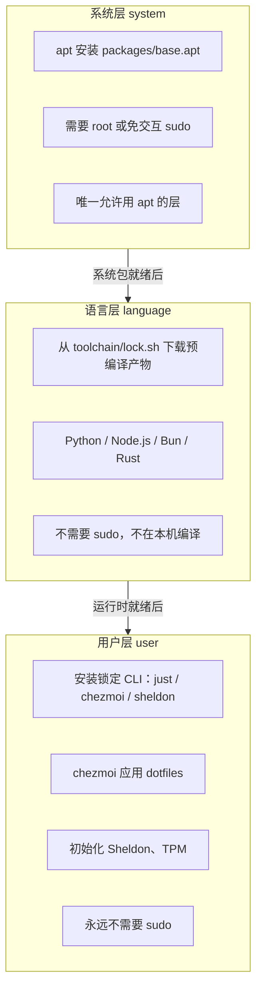
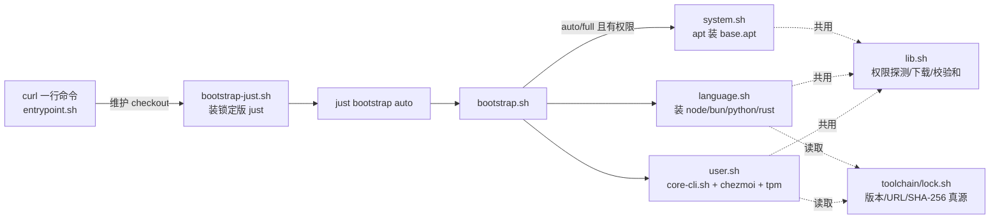
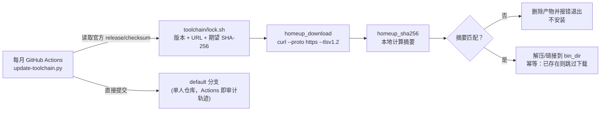
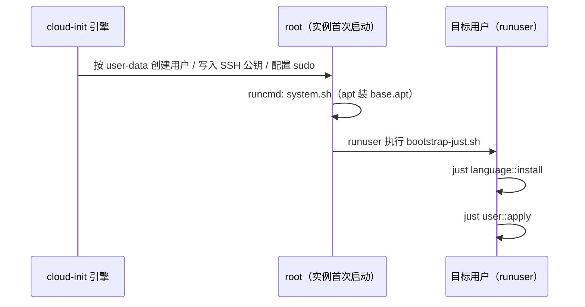
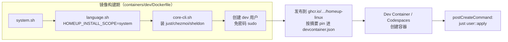

# 架构总览

本文档用图和白话文解读 Homeup Linux 的整体设计，帮助你快速建立心智模型。
**它是 [v1 开发环境契约](dev-environment-v1.md) 的解读版本，不是权威定义**——
两者冲突时，一切以契约为准；架构调整也必须先改契约，再改本文档和实现。

## 1. 一句话概括

Homeup 用「一份锁定的版本清单 + 三个职责分明的安装层」，在五种不同的运行环境
（主机、cloud-init、Docker、Dev Container/Codespaces）里装出同一套开发环境，
同时把「装开发环境」和「初始化一台主机」这两件事严格分开。

## 2. 三层模型

三层是严格的职责边界，不是"三个安装步骤"：

- **系统层**是唯一碰 `apt`/root 的地方，装的是发行版包（编译工具链、zsh、
  运维小工具等），不装任何"版本敏感"的语言运行时或 CLI。
- **语言层**永远不编译、永远不用 `latest`，只下载 `toolchain/lock.sh` 里锁死
  的预编译归档并校验 SHA-256，装到用户自有目录（或镜像构建期的系统目录）。
- **用户层**永远不需要 sudo，只做"属于这个用户"的事：CLI 工具、dotfiles、
  shell 插件。Git 身份是可选的（`HOMEUP_GIT_*`），默认什么都不写。

## 3. 载体 × 层：谁跑哪几层

| 载体 | 系统层 | 语言层 | 用户层 | 典型触发方式 |
| --- | --- | --- | --- | --- |
| 有 root/sudo 的主机、VM | 装 | 装 | 装 | `just bootstrap` / `bootstrap full` |
| 无 sudo 的共享主机 | 跳过（报告不可用） | 装到 `~/.local` | 装 | `just bootstrap user` |
| cloud-init 实例 | cloud-init 建用户后装 | 以目标用户装 | 以目标用户装 | user-data 里的 `runcmd` |
| Docker 镜像 | 构建期装 | 构建期装 | **不装** | `Dockerfile` 的 `RUN` |
| Dev Container / Codespaces | 镜像里已有 | 镜像里已有 | 容器创建后装 | `postCreateCommand` |

同一套 `scripts/bootstrap/*.sh` 被所有载体复用；不同的只是"谁来调用它、
以什么身份调用、调用到哪一层为止"。这是维持"一致性"的关键：没有第二套
安装逻辑。

## 4. 命令与脚本的调用链

几个关键点：

- `entrypoint.sh` 只负责拿到/更新 checkout 并调用 `just bootstrap auto`，
  **不重复实现**任何安装逻辑——这是契约里明确写死的约束，避免出现"curl 版"
  和"仓库版"两套行为不一致的安装脚本。
- `lib.sh` 是所有层共用的基础设施：权限探测（`homeup_can_system_install`）、
  带校验和的下载（`homeup_download`）、跨架构判断（`homeup_arch`）。
- `lock.sh` 是唯一的版本真源，`language.sh`、`core-cli.sh`、`doctor.sh` 都从
  它读取版本号、下载 URL 和 SHA-256，没有任何脚本自己拼 `latest` URL。

## 5. 供应链信任链路

`scripts/ci/validate-lock.sh` 在 CI 里强制锁文件的形状：URL 必须是
`https://` 且不含 `latest`，SHA-256 必须是合法的 64 位十六进制。
`scripts/ci/update-toolchain.py` 每月从各项目的官方 release 元数据
（GitHub Releases API、`nodejs.org/dist`、`static.rust-lang.org` 的
manifest、`astral-sh/python-build-standalone` 的 release 等）拉取最新
稳定版本和官方校验和，直接写回 `lock.sh` 并提交——不是"人工手抄校验和"，
也不存在第二个校验和来源。

## 6. 四类载体的实际流程

### 主机 / VM

开发环境安装（`bootstrap`）和主机初始化（`host::provision`）是两件独立的事，
`host::ssh-harden` 更是被单独摘出来：它是唯一一个不可逆、必须人在场确认的
操作，永远不会被 bootstrap、cloud-init 或镜像构建自动调用。

### cloud-init

`cloud-init/homeup.yaml.tmpl` 是模板，不是可以直接用的文件——上传前必须用
`envsubst` 渲染成具体值，并人工确认里面没有 token 或私钥。它只接受具名变量，
没有自动 SSH 加固开关。

### Docker 镜像 → Dev Container / Codespaces

镜像里已经有系统层和语言层，**不会**在构建期跑用户层——因为用户密钥和身份
变量在镜像构建、尤其是 Codespaces prebuild 阶段根本不可用。所以
`user::apply` 被单独放进 `postCreateCommand`，在真实用户会话创建之后才执行。

## 7. 目录结构与职责

| 路径 | 职责 |
| --- | --- |
| `scripts/bootstrap/` | 三层的实现 + 探测/下载/校验和的共用库 |
| `scripts/host/` | 仅主机可用的初始化脚本（用户、防火墙、主机名、时区、SSH 加固） |
| `scripts/ci/` | 锁文件校验、每月工具链更新器、更新报告生成 |
| `packages/` | `base.apt`（每个有系统访问权限的载体都要装）与 `host.apt`（仅主机） |
| `toolchain/lock.sh` | 非 apt 产物的唯一版本真源 |
| `containers/dev/Dockerfile` | 唯一的镜像构建定义 |
| `.devcontainer/devcontainer.json` | 引用已发布镜像摘要，创建后跑用户层 |
| `cloud-init/homeup.yaml.tmpl` | user-data 模板，渲染后使用 |
| `dot_*` / `.chezmoi*` | chezmoi 管理的 dotfiles 源 |
| `.github/workflows/` | 校验、镜像发布、每月工具链更新三条流水线 |
| `docs/` | 本文档体系 |

完整的正式定义见契约 [第 6 节](dev-environment-v1.md#6-仓库结构)。

## 8. 想按场景操作，请看

架构讲的是"为什么这样设计"；具体"我现在该敲哪条命令"请看
[场景化使用手册](usage-guide.md)。命令和环境变量的速查表见
[命令参考](commands.md)。
